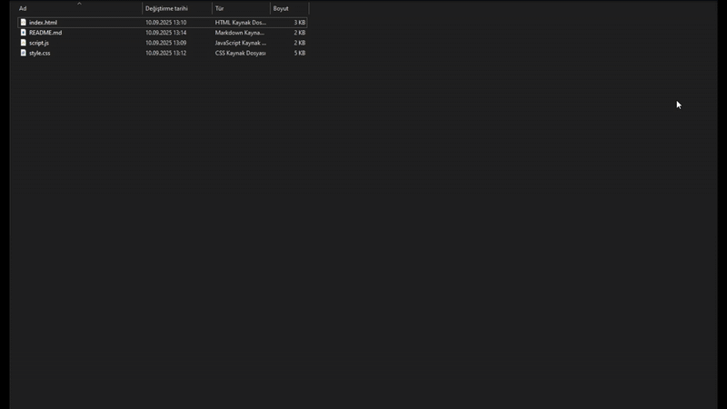

# 🎨 Animated Login & Register Form with Database

Modern ve animasyonlu giriş/kayıt formu. Veritabanı entegrasyonu ile tam işlevsel kullanıcı yönetim sistemi.

## ✨ Özellikler

- 🔄 **Animasyonlu Geçiş**: Giriş ve kayıt formları arasında yumuşak geçişler
- 📱 **Responsive Tasarım**: Tüm cihazlarda mükemmel görünüm
- 🌐 **Sosyal Medya Entegrasyonu**: Instagram, X (Twitter), GitHub ve LinkedIn bağlantıları
- 🎯 **Hover Efektleri**: Sosyal medya ikonlarında orijinal renk efektleri
- 💫 **Modern UI**: Gradient arka plan ve şık tasarım
- 🗄️ **Veritabanı Entegrasyonu**: MySQL ile tam işlevsel kullanıcı sistemi
- 🔐 **Güvenli Şifreleme**: Şifreler hash'lenerek güvenli şekilde saklanır
- ✅ **Form Validasyonu**: Kullanıcı girişi kontrolü ve hata mesajları
- 🔑 **Session Yönetimi**: Kullanıcı oturum yönetimi

## 🚀 Kurulum

### 1. Gereksinimler
- PHP 7.4 veya üzeri
- MySQL 5.7 veya üzeri
- Web sunucusu (Apache/Nginx)

### 2. Kurulum Adımları

1. **Dosyaları İndirin**
   ```bash
   git clone https://github.com/Spexronn/Animated-login-register-page.git
   ```
   ```
   cd animated-login-form
   ```

2. **Veritabanı Hazırlayın**
   
   **Seçenek A: Kendi SQL dosyanız varsa**
   - Kendi SQL dosyanızı kullanarak veritabanınızı oluşturun
   - `index.php` dosyasındaki otomatik tablo oluşturma kodunu kaldırın (isteğe bağlı)
   
   **Seçenek B: Otomatik tablo oluşturma**
   - MySQL'de `login_system` adında bir veritabanı oluşturun
   - Sistem otomatik olarak `users` tablosunu oluşturacak

3. **Veritabanı Ayarlarını Güncelleyin**
   `index.php` dosyasının başındaki veritabanı bilgilerini düzenleyin:
   ```php
   $host = 'localhost';        // Veritabanı sunucu adresi
   $dbname = 'login_system';   // Veritabanı adı
   $username = 'root';         // Veritabanı kullanıcı adı
   $password = '';             // Veritabanı şifresi
   ```

4. **Projeyi Çalıştırın**
   - Dosyaları web sunucunuzun root dizinine kopyalayın
   - `index.php` dosyasını tarayıcınızda açın
   
HTML olarak denenmiştir!


## 🎨 Özelleştirme

- **Renkler**: `style.css` dosyasından değiştirebilirsiniz
- **Sosyal Medya Linkleri**: `script.js` dosyasından güncelleyebilirsiniz
- **Form Alanları**: `index.php` dosyasından düzenleyebilirsiniz
- **Veritabanı Ayarları**: `index.php` dosyasının başındaki PHP kodundan değiştirebilirsiniz

## 🗄️ Veritabanı Yapısı

**Kendi SQL dosyanız varsa:** Mevcut tablo yapınızı kullanabilirsiniz, sadece aşağıdaki alanların bulunduğundan emin olun:

**Otomatik tablo oluşturma kullanıyorsanız:** Sistem otomatik olarak `users` tablosunu oluşturur:

```sql
CREATE TABLE users (
    id INT AUTO_INCREMENT PRIMARY KEY,
    name VARCHAR(100) NOT NULL,
    email VARCHAR(100) UNIQUE NOT NULL,
    password VARCHAR(255) NOT NULL,
    created_at TIMESTAMP DEFAULT CURRENT_TIMESTAMP
);
```

**Gerekli Alanlar:**
- `id` (INT, AUTO_INCREMENT, PRIMARY KEY)
- `name` (VARCHAR(100), NOT NULL)
- `email` (VARCHAR(100), UNIQUE, NOT NULL)
- `password` (VARCHAR(255), NOT NULL)

## 🔧 Teknik Detaylar

- **Backend**: PHP 7.4+
- **Veritabanı**: MySQL 5.7+
- **Frontend**: HTML5, CSS3, JavaScript (ES6)
- **Güvenlik**: PDO prepared statements, password hashing
- **Session**: PHP session yönetimi

## 🛠️ Sorun Giderme

- **Veritabanı Bağlantı Hatası**: Veritabanı bilgilerini kontrol edin
- **Tablo Oluşturma Hatası**: MySQL kullanıcısının CREATE izni olduğundan emin olun
- **Form Çalışmıyor**: PHP'nin çalıştığından emin olun
- **Kendi SQL kullanıyorsanız**: Tablo yapısının gerekli alanları içerdiğinden emin olun
- **Otomatik tablo oluşturma istemiyorsanız**: `index.php`'deki `$pdo->exec($createTable);` satırını kaldırın

## 👨‍💻 Geliştirici

**SPEXRON** tarafından tasarlanmış ve geliştirilmiştir.

